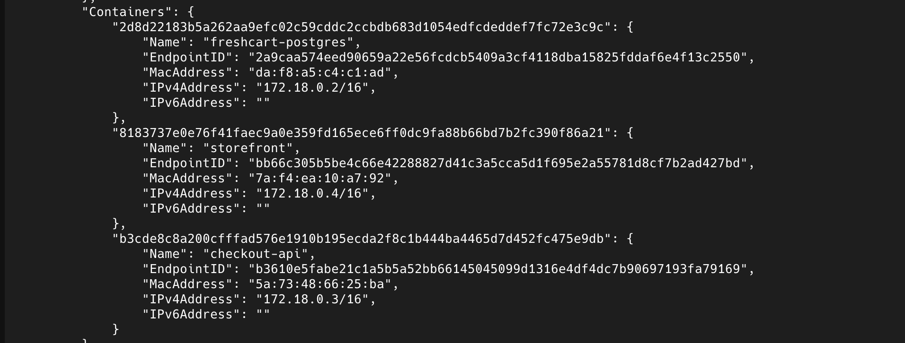
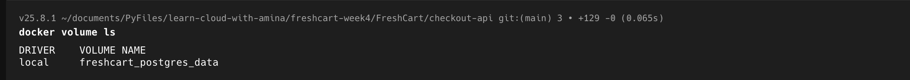
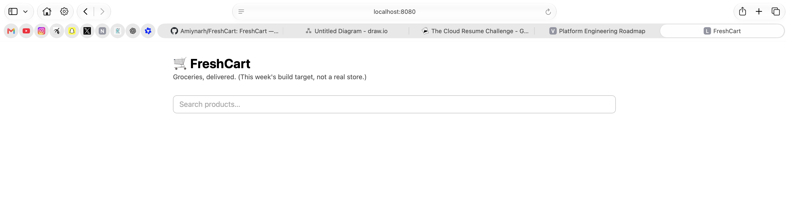
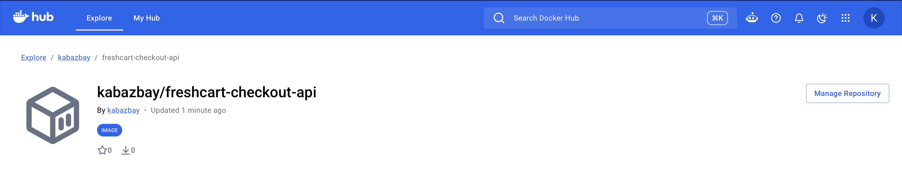
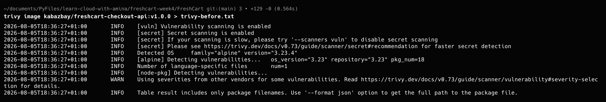
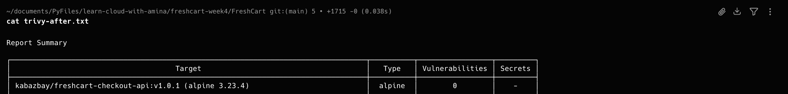

# FreshCart Week 4 Capstone: Containerize, Compose, and Ship a Two-Container Application

## Project Overview

This project is my submission for **Week 4 of the Learn Cloud with Amina Cloud Engineering Program**.

The objective was to containerize a real multi-service application using Docker while following production-oriented best practices.

The application consists of:

- **Storefront** – A Vite + TypeScript frontend served by Nginx.
- **Checkout API** – A Node.js + Express + TypeScript backend.
- **PostgreSQL** – A relational database used to store products and customer orders.

The project demonstrates how multiple services can be packaged into containers, connected through Docker networking, secured using container best practices, and orchestrated with Docker Compose.

---

# Project Objectives

This project demonstrates how to:

- Build optimized multi-stage Docker images.
- Reduce image size using minimal runtime images.
- Run containers as non-root users.
- Use Docker layer caching for faster rebuilds.
- Orchestrate multiple services using Docker Compose.
- Persist database data with Docker volumes.
- Publish container images to Docker Hub.
- Scan container images for vulnerabilities using Trivy.

---

# Architecture

## Container Topology

Insert your **Container Topology Diagram** here.

The application consists of three containers:

```text
Browser
    │
    ▼
Storefront (Nginx)
    │
HTTP
    ▼
Checkout API
    │
PostgreSQL Protocol
    ▼
PostgreSQL
```

All containers communicate through a shared Docker network.

The PostgreSQL container stores its data inside a Docker named volume.

---

# Multi-stage Build Architecture

Insert your **Layer Diagram** here.

Both services use multi-stage Docker builds.

### Build Stage

- Install dependencies.
- Compile the application.
- Generate production artifacts.

### Runtime Stage

- Start from a lightweight base image.
- Copy only the compiled application.
- Exclude development tools and temporary files.
- Run as a non-root user.

Benefits:

- Smaller image size
- Faster deployments
- Better security
- Reduced attack surface

---

# Project Structure

```text
freshcart-week4-capstone/
│
├── README.md
├── docker-compose.yml
│
├── checkout-api/
│   ├── Dockerfile
│   ├── src/
│   └── db/
│
├── storefront/
│   ├── Dockerfile
│   └── src/
│
├── diagrams/
│   ├── container-topology.png
│   └── multi-stage-layer.png
│
├── scans/
│   ├── trivy-before.txt
│   ├── trivy-after.txt
│   └── screenshots/
│
├── commands/
│   └── docker-commands.md
│
├── blog/
│   └── article.md
│
└── images/
```

---

# Technologies Used

- Docker
- Docker Compose
- Docker Hub
- Trivy
- Node.js
- Express
- TypeScript
- Vite
- Nginx
- PostgreSQL

---

# Docker Images

## Checkout API

- Multi-stage Dockerfile
- Node 20 Alpine
- Non-root user
- Optimized build layers

## Storefront

- Multi-stage Dockerfile
- Nginx Alpine
- Static production build
- Non-root user

---

# Docker Compose

Docker Compose manages:

- Storefront container
- Checkout API container
- PostgreSQL container
- Shared Docker network
- Named Docker volume

The complete application starts with:

```bash
docker compose up --build
```

---

# Persistent Storage

A Docker named volume is attached to PostgreSQL.

```text
postgres_data
```

This ensures application data remains available even if the PostgreSQL container is recreated.

---

# Networking

Docker Compose automatically creates a private bridge network.

All containers communicate using service names.

Example:

```text
checkout-api
```

connects to

```text
postgres
```

instead of using IP addresses.

---

# Docker Layer Caching

The Dockerfiles were structured to maximize layer caching.

Instead of copying the source code first:

```Dockerfile
COPY package*.json ./
RUN npm install

COPY . .
```

This allows Docker to reuse cached dependency layers whenever only application code changes.

Benefits:

- Faster rebuilds
- Less network traffic
- Improved developer productivity

---

# Security Improvements

Several security best practices were implemented.

### Non-root User

Both containers run as dedicated non-root users.

This reduces the impact of a compromised container.

---

### Minimal Images

The project uses lightweight Alpine Linux images.

- node:20-alpine
- nginx:alpine

Smaller images reduce the attack surface and improve deployment speed.

---

### Vulnerability Scanning

Container images were scanned using Trivy.

Included:

- Before scan
- After scan
- Vulnerability remediation

Insert screenshots here.

---

# Docker Hub

Checkout API Image:

```text
kabazbay/freshcart-checkout-api:v1.0.0
```

Docker Hub Repository:

https://hub.docker.com/r/kabazbay/freshcart-checkout-api

---

# Running the Project

## Clone the repository

```bash
git clone https://github.com/kabazbay/freshcart-week4-capstone.git

cd freshcart-week4-capstone
```

---

## Build and start

```bash
docker compose up --build
```

---

## View the application

Storefront

```text
http://localhost:8080
```

API Health Check

```text
http://localhost:3000/healthz
```

Products

```text
http://localhost:3000/api/products
```

---

# Screenshots

- docker compose up --build


- docker ps
![Container list(images/docker-ps.png)

- docker volume ls


- Browser running FreshCart


- Docker Hub


- Trivy Before


- Trivy After


---

# Lessons Learned

This project helped me understand:

- Docker images vs containers.
- Multi-stage Docker builds.
- Docker layer caching.
- Docker Compose orchestration.
- Container networking.
- Persistent Docker volumes.
- Running containers securely as non-root users.
- Publishing container images.
- Vulnerability scanning with Trivy.

---

# Future Improvements

Possible future enhancements include:

- Kubernetes deployment
- CI/CD pipeline with GitHub Actions
- HTTPS using Nginx reverse proxy
- Prometheus monitoring
- Grafana dashboards
- Automated image scanning
- Container image signing
- Secrets management

---

# Blog Post

Read the complete walkthrough here:

https://medium.com/@kabazbay98/containerizing-a-real-application-with-docker-building-and-securing-freshcart-37dd66d507a3

---

# Author

**Akintomiwa Azeez**

Cloud Engineering Student

Week 4 Capstone Project

Learn Cloud with Amina